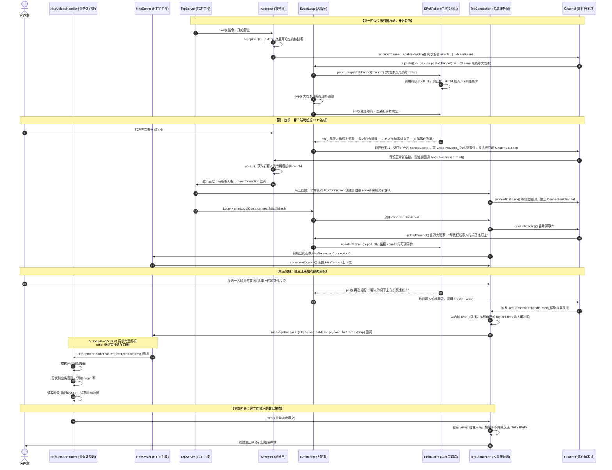

# 监听与数据通信底层时序图 (Reactor 模式)

```mermaid
sequenceDiagram
    autonumber
    actor Client as 客户端
    participant Handler as HttpUploadHandler (业务处理器)
    participant HSrv as HttpServer (HTTP主控)
    participant Srv as TcpServer (TCP主控)
    participant Acc as Acceptor (接待员)
    participant EL as EventLoop (大管家)
    participant Poller as EPollPoller (内核侦察兵)
    participant Conn as TcpConnection (专属服务员)
    participant Chan as Channel (事件档案袋)

    Note over Srv, Chan: 【第一阶段：服务器启动，开启监听】
    Srv->>Acc: start() 指令，开始营业
    Acc->>Acc: acceptSocket_.listen() 底层开始在内核接客
    Acc->>Chan: acceptChannel_.enableReading() 内部设置 events_ |= kReadEvent
    Chan->>EL: update() -> loop_->updateChannel(this) (Channel甩锅给大管家)
    EL->>Poller: poller_->updateChannel(channel) (大管家又甩锅给Poller)
    Poller->>Poller: 调用内核 epoll_ctl，真正把 listenfd 加入 epoll 红黑树
    EL->>EL: loop() 大管家开始死循环巡逻
    EL->>Poller: poll() 阻塞等待，直到有事件发生...

    Note over Client, Chan: 【第二阶段：客户端发起新 TCP 连接】
    Client->>Acc: TCP三次握手 (SYN)
    Poller-->>EL: poll() 苏醒，告诉大管家：“监听门有动静！”，有人送档案袋来了！(就绪事件列表)
    EL->>Chan: 翻开档案袋，调用对应的 handleEvent()，置 Chan->revents_ 为实际事件，并执行回调 Chan->Callback
    Chan->>Acc: 假设正常新连接，则触发回调 Acceptor::handleRead()
    Acc->>Acc: accept() 获取新客人的专用套接字 connfd
    Acc->>Srv: 通知主控：有新客人啦！(newConnection 回调)
    Srv->>Conn: 马上创建一个专属的 TcpConnection 创建非阻塞 socket 来服务新客人
    Conn->>Chan: setReadCallback() 等绑定回调，建立 ConnectionChannel
    Srv->>EL: Loop->runInLoop(Conn::connectEstablished) 
    EL->>Conn: 调用 connectEstablished
    Conn->>Chan: enableReading() 启用读事件
    Chan->>EL: updateChannel() 告诉大管家：“帮我把新客人的桌子也盯上”
    EL->>Poller: updateChannel() epoll_ctl，监控 connfd 的可读事件
    Conn->>HSrv: 调用回调函数 HttpServer::onConnection()
    HSrv->>Conn: conn->setContext() 设置 HttpContext 上下文

    Note over Client, Chan: 【第三阶段：建立连接后的数据接收】
    Client->>Conn: 发送一大段业务数据 (比如上传的文件片段)
    Poller-->>EL: poll() 再次苏醒：“客人的桌子上有新数据啦！”
    EL->>Chan: 取出客人的档案袋，调用 handleEvent()
    Chan->>Conn: 触发 TcpConnection::handleRead()读取底层数据
    Conn->>Conn: 从内核 read() 数据，存进自己的 InputBuffer (输入缓冲区)
    Conn->>HSrv: messageCallback_(HttpServer::onMessage, conn, buf, Timestamp) 回调
    Note over Handler, HSrv: /upload&>=1MB OR 请求完整解析<br/>other 继续等待更多数据
    HSrv->>Handler: HttpUploadHandler::onRequest(conn,req,resp)回调
    Handler->>Handler: 根据path匹配路由
    Handler->>Handler: 分发到业务函数，例如 /login 等
    Handler->>Handler: 读写磁盘/执行MySQL，返回业务数据

    Note over Client, Conn:【第四阶段：建立连接后的数据接收】
    Handler->>Conn: send(业务响应报文)
    Conn->>Conn: 直接 write() 给客户端，如果写不完则放进 OutputBuffer
    Conn->>Client: 通过底层网络发回给客户端
```

# 备注
## 重要类
Acceptor 负责新连接创建回调
TcpConnection 负责连接的数据读写回调
Channel 负责存储事件的信息（fd、事件等）