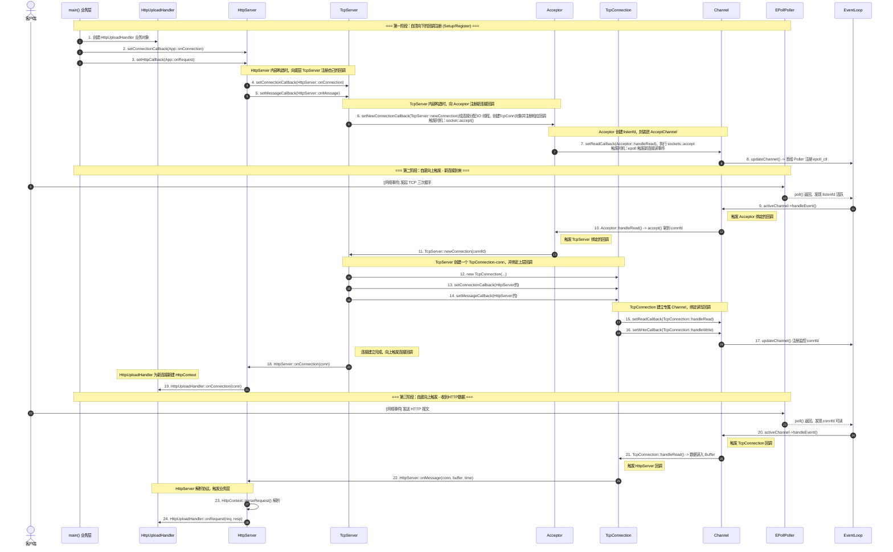

# 回调函数注册与触发全景时序图

```mermaid
sequenceDiagram
    autonumber
    
    actor Client as 客户端
    participant Main as main() 业务层
    participant App as HttpUploadHandler
    participant HttpServer
    participant TcpServer
    participant Acceptor
    participant TcpConn as TcpConnection
    participant Channel
    participant Poller as EPollPoller
    participant EventLoop as EventLoop
    
    Note over Main, Poller: === 第一阶段：自顶向下的回调注册 (Setup/Register) ===
    
    Main->>App: 1. 创建 HttpUploadHandler 业务对象
    Main->>HttpServer: 2. setConnectionCallback(App::onConnection)
    Main->>HttpServer: 3. setHttpCallback(App::onRequest)
    
    Note over HttpServer, TcpServer: HttpServer 内部构造时，向底层 TcpServer 注册自己的回调
    HttpServer->>TcpServer: 4. setConnectionCallback(HttpServer::onConnection)
    HttpServer->>TcpServer: 5. setMessageCallback(HttpServer::onMessage)
    
    Note over TcpServer, Acceptor: TcpServer 内部构造时，向 Acceptor 注册新连接回调
    TcpServer->>Acceptor: 6. setNewConnectionCallback(TcpServer::newConnection)给连接分配 IO 线程，创建TcpConn对象并注册相应回调<br/>触发时机：socket::accept()
    
    Note over Acceptor, Channel: Acceptor 创建 listenfd，封装进 AcceptChannel
    Acceptor->>Channel: 7. setReadCallback(Acceptor::handleRead)，执行 sockets::accept<br/>触发时机：epoll 触发新连接读事件
    Channel->>EventLoop: 8. updateChannel() -> 丢给 Poller 注册 epoll_ctl
    
    Note over Main, Poller: === 第二阶段：自底向上触发 - 新连接到来 ===
    
    Client->>Poller: [网络事件] 发起 TCP 三次握手
    Poller-->>EventLoop: poll() 返回，发现 listenfd 活跃
    EventLoop->>Channel: 9. activeChannel->handleEvent()
    
    Note right of Channel: 触发 Acceptor 绑定的回调
    Channel->>Acceptor: 10. Acceptor::handleRead() -> accept() 拿到 connfd
    
    Note right of Acceptor: 触发 TcpServer 绑定的回调
    Acceptor->>TcpServer: 11. TcpServer::newConnection(connfd)
    
    Note over TcpServer, TcpConn: TcpServer 创建一个 TcpConnection-conn，并绑定上层回调
    TcpServer->>TcpConn: 12. new TcpConnection(...)
    TcpServer->>TcpConn: 13. setConnectionCallback(HttpServer的)
    TcpServer->>TcpConn: 14. setMessageCallback(HttpServer的)
    
    Note over TcpConn, Channel: TcpConnection 建立专属 Channel，绑定读写回调
    TcpConn->>Channel: 15. setReadCallback(TcpConnection::handleRead)
    TcpConn->>Channel: 16. setWriteCallback(TcpConnection::handleWrite)
    Channel->>EventLoop: 17. updateChannel() 注册监控 connfd
    
    Note right of TcpServer: 连接建立完成，向上触发连接回调
    TcpServer->>HttpServer: 18. HttpServer::onConnection(conn)
    Note over App: HttpUploadHandler 为新连接新建 HttpContext
    HttpServer->>App: 19. HttpUploadHandler::onConnection(conn)
    
    Note over Main, Poller: === 第三阶段：自底向上触发 - 收到HTTP数据 ===
    
    Client->>Poller: [网络事件] 发送 HTTP 报文
    Poller-->>EventLoop: poll() 返回，发现 connfd 可读
    EventLoop->>Channel: 20. activeChannel->handleEvent()
    
    Note right of Channel: 触发 TcpConnection 回调
    Channel->>TcpConn: 21. TcpConnection::handleRead() -> 数据读入 Buffer
    
    Note right of TcpConn: 触发 HttpServer 回调
    TcpConn->>HttpServer: 22. HttpServer::onMessage(conn, buffer, time)
    
    Note over HttpServer, App: HttpServer 解析协议，触发业务层
    HttpServer->>HttpServer: 23. HttpContext::parseRequest() 解析
    HttpServer->>App: 24. HttpUploadHandler::onRequest(req, resp)
```
