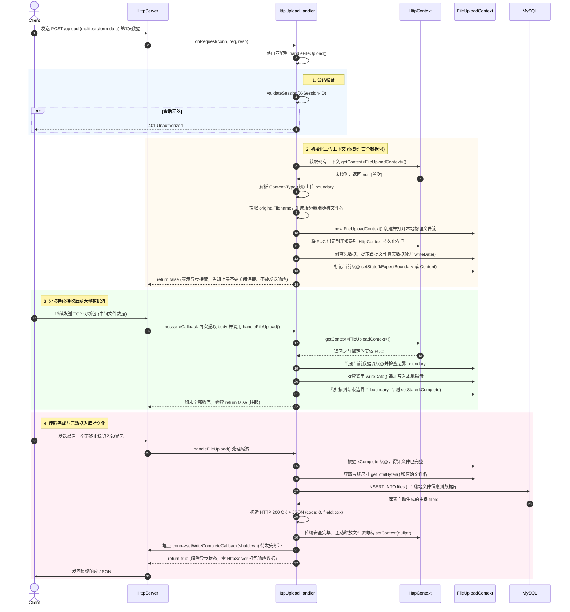

# 文件上传底层流转时序图

```mermaid
sequenceDiagram
    autonumber
    actor C as Client
    participant HS as HttpServer
    participant HUH as HttpUploadHandler
    participant CTX as HttpContext
    participant FUC as FileUploadContext
    participant DB as MySQL

    C->>HS: 发送 POST /upload (multipart/form-data) 第1块数据
    HS->>HUH: onRequest(conn, req, resp)
    HUH->>HUH: 路由匹配到 handleFileUpload()

    rect rgb(240, 248, 255)
        note right of HUH: 1. 会话验证
        HUH->>HUH: validateSession(X-Session-ID)
        alt 会话无效
            HUH-->>C: 401 Unauthorized
        end
    end

    rect rgb(255, 250, 240)
        note right of HUH: 2. 初始化上传上下文 (仅处理首个数据包)
        HUH->>CTX: 获取现有上下文 getContext<FileUploadContext>()
        CTX-->>HUH: 未找到，返回 null (首次)
        HUH->>HUH: 解析 Content-Type 获取上传 boundary
        HUH->>HUH: 提取 originalFilename，生成服务器端随机文件名 
        HUH->>FUC: new FileUploadContext() 创建并打开本地物理文件流
        HUH->>CTX: 将 FUC 绑定到连接级别 HttpContext 持久化存活
        HUH->>FUC: 剥离头数据，提取首批文件真实数据流并 writeData()
        HUH->>FUC: 标记当前状态 setState(kExpectBoundary 或 Content)
        HUH-->>HS: return false (表示异步接管，告知上层不要关闭连接、不要发送响应)
    end

    rect rgb(240, 255, 240)
        note right of C: 3. 分块持续接收后续大量数据流
        C->>HS: 继续发送 TCP 切断包 (中间文件数据)
        HS->>HUH: messageCallback 再次提取 body 并调用 handleFileUpload()
        HUH->>CTX: getContext<FileUploadContext>()
        CTX-->>HUH: 返回之前绑定的实体 FUC
        HUH->>FUC: 判别当前数据流状态并检查边界 boundary
        HUH->>FUC: 持续调用 writeData() 追加写入本地磁盘
        HUH->>FUC: 若扫描到结束边界 "--boundary--", 则 setState(kComplete)
        HUH-->>HS: 如未全部收完，继续 return false (挂起)
    end

    rect rgb(255, 240, 245)
        note right of C: 4. 传输完成与元数据入库持久化
        C->>HS: 发送最后一个带终止标记的边界包
        HS->>HUH: handleFileUpload() 处理尾流
        HUH->>FUC: 根据 kComplete 状态，得知文件已完整
        HUH->>FUC: 获取最终尺寸 getTotalBytes() 和原始文件名
        HUH->>DB: INSERT INTO files (...) 落地文件信息到数据库
        DB-->>HUH: 库表自动生成的主键 fileId
        HUH->>HUH: 构造 HTTP 200 OK + JSON {code: 0, fileId: xxx}
        HUH->>CTX: 传输安全完毕，主动释放文件流句柄 setContext(nullptr)
        HUH->>HS: 埋点 conn->setWriteCompleteCallback(shutdown) 待发完断带
        HUH-->>HS: return true (解除异步状态，令 HttpServer 打包响应数据)
        HS->>C: 发回最终响应 JSON
    end
```