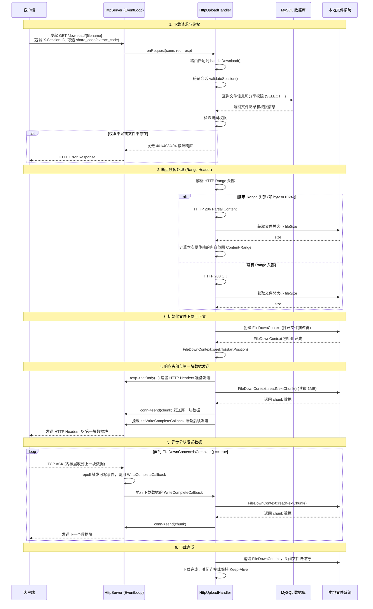

# 文件下载与断点续传时序图

```mermaid
sequenceDiagram
    participant Client as 客户端
    participant Server as HttpServer (EventLoop)
    participant Handler as HttpUploadHandler
    participant DB as MySQL 数据库
    participant Disk as 本地文件系统

    Note over Client, Disk: 1. 下载请求与鉴权
    Client->>Server: 发起 GET /download/{filename} <br/>(包含 X-Session-ID, 可选 share_code/extract_code)
    Server->>Handler: onRequest(conn, req, resp)
    Handler->>Handler: 路由匹配到 handleDownload()
    Handler->>Handler: 验证会话 validateSession()
    Handler->>DB: 查询文件信息和分享权限 (SELECT ...)
    DB-->>Handler: 返回文件记录和权限信息
    Handler->>Handler: 检查访问权限
    
    alt 权限不足或文件不存在
        Handler-->>Server: 发送 401/403/404 错误响应
        Server-->>Client: HTTP Error Response
    end

    Note over Client, Disk: 2. 断点续传处理 (Range Header)
    Handler->>Handler: 解析 HTTP Range 头部
    alt 携带 Range 头部 (如 bytes=1024-)
        Handler->>Handler: HTTP 206 Partial Content
        Handler->>Disk: 获取文件总大小 fileSize
        Disk-->>Handler: size
        Handler->>Handler: 计算本次要传输的内容范围 Content-Range
    else 没有 Range 头部
        Handler->>Handler: HTTP 200 OK
        Handler->>Disk: 获取文件总大小 fileSize
        Disk-->>Handler: size
    end

    Note over Client, Disk: 3. 初始化文件下载上下文
    Handler->>Disk: 创建 FileDownContext (打开文件描述符)
    Disk-->>Handler: FileDownContext 初始化完成
    Handler->>Handler: FileDownContext::seekTo(startPosition)
    
    Note over Client, Disk: 4. 响应头部与第一块数据发送
    Handler->>Server: resp->setBody(...) 设置 HTTP Headers 准备发送
    Handler->>Disk: FileDownContext::readNextChunk() (读取 1MB)
    Disk-->>Handler: 返回 chunk 数据
    Handler->>Server: conn->send(chunk) 发送第一块数据
    Handler->>Server: 挂载 setWriteCompleteCallback 准备后续发送
    Server-->>Client: 发送 HTTP Headers 及 第一块数据块
    
    Note over Client, Disk: 5. 异步分块发送数据
    loop 直到 FileDownContext::isComplete() == true
        Client-->>Server: TCP ACK (内核层收到上一块数据)
        Server->>Server: epoll 触发可写事件，调用 WriteCompleteCallback
        Server->>Handler: 执行下载数据的 WriteCompleteCallback
        Handler->>Disk: FileDownContext::readNextChunk()
        Disk-->>Handler: 返回 chunk 数据
        Handler->>Server: conn->send(chunk)
        Server-->>Client: 发送下一个数据块
    end

    Note over Client, Disk: 6. 下载完成
    Handler->>Disk: 销毁 FileDownContext，关闭文件描述符
    Handler->>Handler: 下载完成，关闭连接或保持 Keep-Alive
```