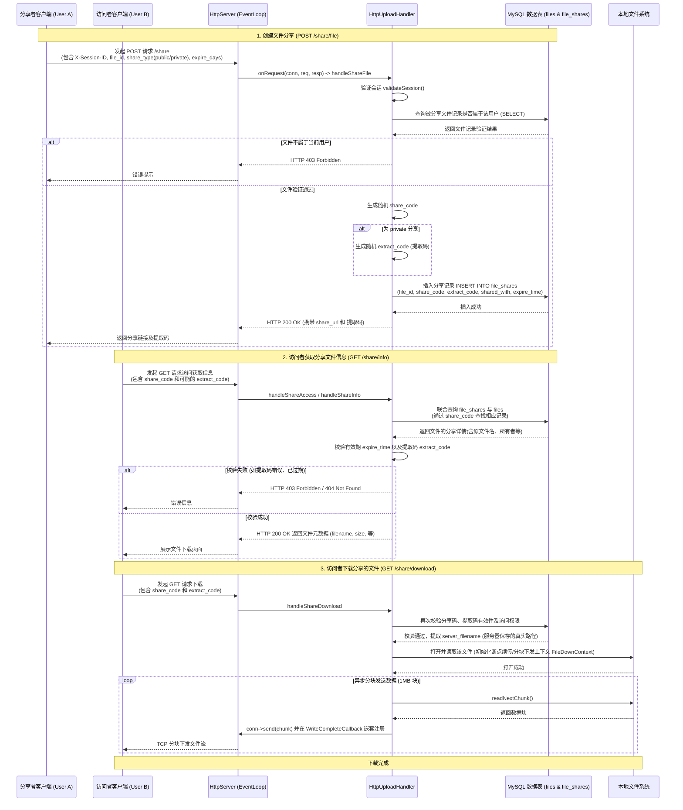

# 文件分享时序图

```mermaid
sequenceDiagram
    participant UserA as 分享者客户端 (User A)
    participant UserB as 访问者客户端 (User B)
    participant Server as HttpServer (EventLoop)
    participant Handler as HttpUploadHandler
    participant DB as MySQL 数据表 (files & file_shares)
    participant Disk as 本地文件系统

    Note over UserA, DB: 1. 创建文件分享 (POST /share/file)
    UserA->>Server: 发起 POST 请求 /share <br/>(包含 X-Session-ID, file_id, share_type(public/private), expire_days)
    Server->>Handler: onRequest(conn, req, resp) -> handleShareFile
    Handler->>Handler: 验证会话 validateSession()
    Handler->>DB: 查询被分享文件记录是否属于该用户 (SELECT)
    DB-->>Handler: 返回文件记录验证结果
    
    alt 文件不属于当前用户
        Handler-->>Server: HTTP 403 Forbidden
        Server-->>UserA: 错误提示
    else 文件验证通过
        Handler->>Handler: 生成随机 share_code
        alt 为 private 分享
            Handler->>Handler: 生成随机 extract_code (提取码)
        end
        Handler->>DB: 插入分享记录 INSERT INTO file_shares<br/>(file_id, share_code, extract_code, shared_with, expire_time)
        DB-->>Handler: 插入成功
        Handler-->>Server: HTTP 200 OK (携带 share_url 和 提取码)
        Server-->>UserA: 返回分享链接及提取码
    end

    Note over UserB, DB: 2. 访问者获取分享文件信息 (GET /share/info)
    UserB->>Server: 发起 GET 请求访问获取信息<br/>(包含 share_code 和可能的 extract_code)
    Server->>Handler: handleShareAccess / handleShareInfo
    Handler->>DB: 联合查询 file_shares 与 files<br/>(通过 share_code 查找相应记录)
    DB-->>Handler: 返回文件的分享详情(含原文件名、所有者等)
    
    Handler->>Handler: 校验有效期 expire_time 以及提取码 extract_code
    alt 校验失败 (如提取码错误、已过期)
        Handler-->>Server: HTTP 403 Forbidden / 404 Not Found
        Server-->>UserB: 错误信息
    else 校验成功
        Handler-->>Server: HTTP 200 OK 返回文件元数据 (filename, size, 等)
        Server-->>UserB: 展示文件下载页面
    end

    Note over UserB, Disk: 3. 访问者下载分享的文件 (GET /share/download)
    UserB->>Server: 发起 GET 请求下载<br/>(包含 share_code 和 extract_code)
    Server->>Handler: handleShareDownload
    Handler->>DB: 再次校验分享码、提取码有效性及访问权限
    DB-->>Handler: 校验通过，提取 server_filename (服务器保存的真实路径)
    
    Handler->>Disk: 打开并读取该文件 (初始化断点续传/分块下发上下文 FileDownContext)
    Disk-->>Handler: 打开成功
    
    loop 异步分块发送数据 (1MB 块)
        Handler->>Disk: readNextChunk()
        Disk-->>Handler: 返回数据块
        Handler->>Server: conn->send(chunk) 并在 WriteCompleteCallback 嵌套注册
        Server-->>UserB: TCP 分块下发文件流
    end
    
    Note over UserB, Disk: 下载完成
```