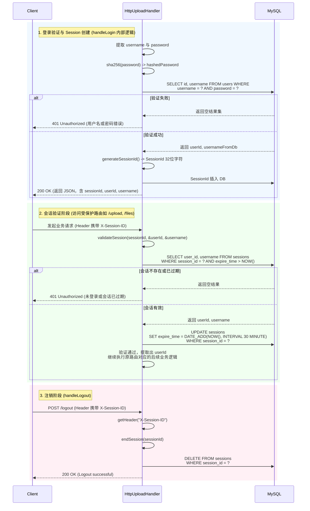

```mermaid
sequenceDiagram
    participant C as Client
    participant H as HttpUploadHandler
    participant DB as MySQL

    rect rgb(240, 248, 255)
        note right of C: 1. 登录验证与 Session 创建 (handleLogin 内部逻辑)
        H->>H: 提取 username 与 password
        H->>H: sha256(password) -> hashedPassword
        H->>DB: SELECT id, username FROM users WHERE<br/>username = ? AND password = ?
        alt 验证失败
            DB-->>H: 返回空结果集
            H-->>C: 401 Unauthorized (用户名或密码错误)
        else 验证成功
            DB-->>H: 返回 userId, usernameFromDb
            H->>H: generateSessionId() -> SessionId 32位字符
            H->>DB: SessionId 插入 DB 
            H-->>C: 200 OK (返回 JSON，含 sessionId, userId, username)
        end
    end

    rect rgb(240, 255, 240)
        note right of C: 2. 会话验证阶段 (访问受保护路由如 /upload, /files)
        C->>H: 发起业务请求 (Header 携带 X-Session-ID)
        H->>H: validateSession(sessionId, &userId, &username)
        H->>DB: SELECT user_id, username FROM sessions <br/>WHERE session_id = ? AND expire_time > NOW()
        alt 会话不存在或已过期
            DB-->>H: 返回空结果
            H-->>C: 401 Unauthorized (未登录或会话已过期)
        else 会话有效
            DB-->>H: 返回 userId, username
            H->>DB: UPDATE sessions <br/>SET expire_time = DATE_ADD(NOW(), INTERVAL 30 MINUTE) <br/>WHERE session_id = ?
            H->>H: 验证通过，提取出 userId<br/>继续执行原路由对应的后续业务逻辑
        end
    end

    rect rgb(255, 240, 245)
        note right of C: 3. 注销阶段 (handleLogout)
        C->>H: POST /logout (Header 携带 X-Session-ID)
        H->>H: getHeader("X-Session-ID")
        H->>H: endSession(sessionId)
        H->>DB: DELETE FROM sessions <br/>WHERE session_id = ?
        H-->>C: 200 OK (Logout successful)
    end
```