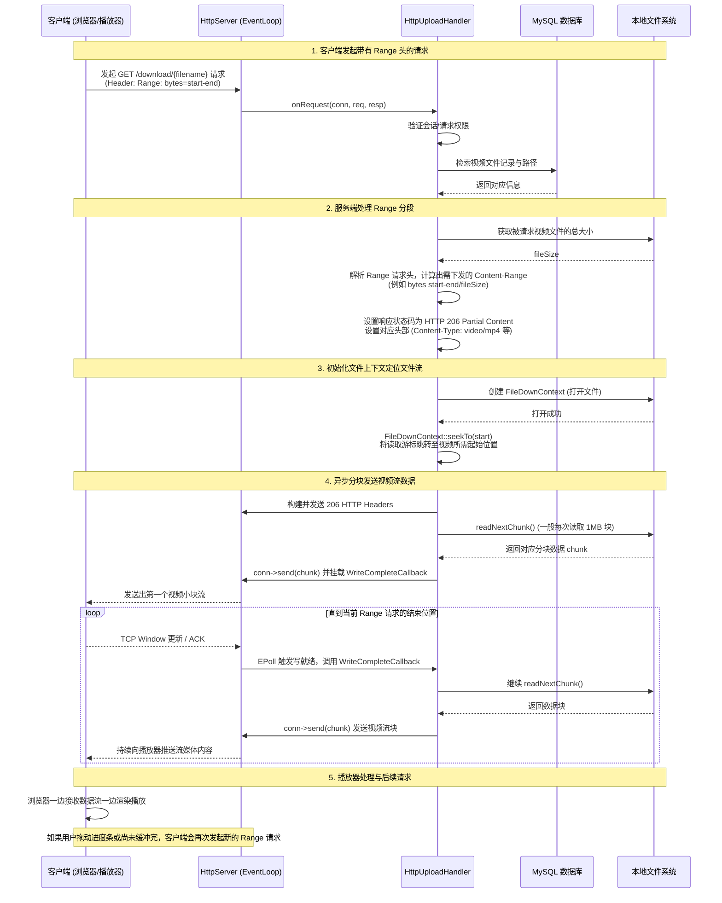

# 视频流式传输时序图

```mermaid
sequenceDiagram
    participant Client as 客户端 (浏览器/播放器)
    participant Server as HttpServer (EventLoop)
    participant Handler as HttpUploadHandler
    participant DB as MySQL 数据库
    participant Disk as 本地文件系统

    Note over Client, Disk: 1. 客户端发起带有 Range 头的请求
    Client->>Server: 发起 GET /download/{filename} 请求<br/>(Header: Range: bytes=start-end)
    Server->>Handler: onRequest(conn, req, resp)
    Handler->>Handler: 验证会话/请求权限
    Handler->>DB: 检索视频文件记录与路径
    DB-->>Handler: 返回对应信息

    Note over Client, Disk: 2. 服务端处理 Range 分段
    Handler->>Disk: 获取被请求视频文件的总大小
    Disk-->>Handler: fileSize
    Handler->>Handler: 解析 Range 请求头，计算出需下发的 Content-Range<br/>(例如 bytes start-end/fileSize)
    Handler->>Handler: 设置响应状态码为 HTTP 206 Partial Content<br/>设置对应头部 (Content-Type: video/mp4 等)

    Note over Client, Disk: 3. 初始化文件上下文定位文件流
    Handler->>Disk: 创建 FileDownContext (打开文件)
    Disk-->>Handler: 打开成功
    Handler->>Handler: FileDownContext::seekTo(start)<br/>将读取游标跳转至视频所需起始位置

    Note over Client, Disk: 4. 异步分块发送视频流数据
    Handler->>Server: 构建并发送 206 HTTP Headers
    Handler->>Disk: readNextChunk() (一般每次读取 1MB 块)
    Disk-->>Handler: 返回对应分块数据 chunk
    Handler->>Server: conn->send(chunk) 并挂载 WriteCompleteCallback
    Server-->>Client: 发送出第一个视频小块流
    
    loop 直到当前 Range 请求的结束位置
        Client-->>Server: TCP Window 更新 / ACK
        Server->>Handler: EPoll 触发写就绪，调用 WriteCompleteCallback
        Handler->>Disk: 继续 readNextChunk()
        Disk-->>Handler: 返回数据块
        Handler->>Server: conn->send(chunk) 发送视频流块
        Server-->>Client: 持续向播放器推送流媒体内容
    end
    
    Note over Client, Disk: 5. 播放器处理与后续请求
    Client->>Client: 浏览器一边接收数据流一边渲染播放
    Note over Client, Server: 如果用户拖动进度条或尚未缓冲完，客户端会再次发起新的 Range 请求
```
